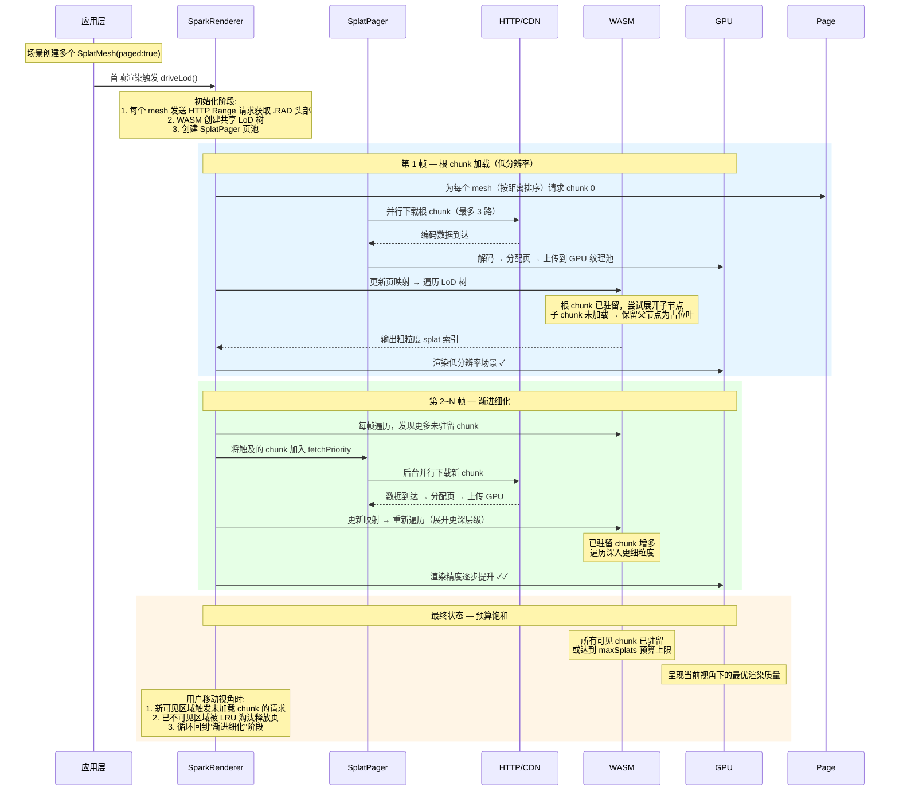

# Spark 渐进式渲染生命周期（精简版）

```mermaid
sequenceDiagram
    participant App as 应用层
    participant SR as SparkRenderer
    participant Pager as SplatPager
    participant Net as HTTP/CDN
    participant WASM as WASM
    participant GPU as GPU

    Note over App: 场景创建多个 SplatMesh(paged:true)
    App->>SR: 首帧渲染触发 driveLod()

    Note over SR: 初始化阶段:<br/>1. 每个 mesh 发送 HTTP Range 请求获取 .RAD 头部<br/>2. WASM 创建共享 LoD 树<br/>3. 创建 SplatPager 页池

    rect rgb(230,245,255)
        Note over SR,GPU: 第 1 帧 — 根 chunk 加载（低分辨率）

        SR->>Page: 为每个 mesh（按距离排序）请求 chunk 0
        Pager->>Net: 并行下载根 chunk（最多 3 路）
        Net-->>Pager: 编码数据到达
        Pager->>GPU: 解码 → 分配页 → 上传到 GPU 纹理池
        SR->>WASM: 更新页映射 → 遍历 LoD 树
        Note over WASM: 根 chunk 已驻留，尝试展开子节点<br/>子 chunk 未加载 → 保留父节点为占位叶
        WASM-->>SR: 输出粗粒度 splat 索引
        SR->>GPU: 渲染低分辨率场景 ✓
    end

    rect rgb(230,255,230)
        Note over SR,GPU: 第 2~N 帧 — 渐进细化

        SR->>WASM: 每帧遍历，发现更多未驻留 chunk
        SR->>Pager: 将触及的 chunk 加入 fetchPriority
        Pager->>Net: 后台并行下载新 chunk
        Net-->>Pager: 数据到达 → 分配页 → 上传 GPU
        SR->>WASM: 更新映射 → 重新遍历（展开更深层级）
        Note over WASM: 已驻留 chunk 增多<br/>遍历深入更细粒度
        SR->>GPU: 渲染精度逐步提升 ✓✓
    end

    rect rgb(255,245,230)
        Note over SR,GPU: 最终状态 — 预算饱和

        Note over WASM: 所有可见 chunk 已驻留<br/>或达到 maxSplats 预算上限
        Note over GPU: 呈现当前视角下的最优渲染质量

        Note over SR: 用户移动视角时:<br/>1. 新可见区域触发未加载 chunk 的请求<br/>2. 已不可见区域被 LRU 淘汰释放页<br/>3. 循环回到"渐进细化"阶段
    end
```
