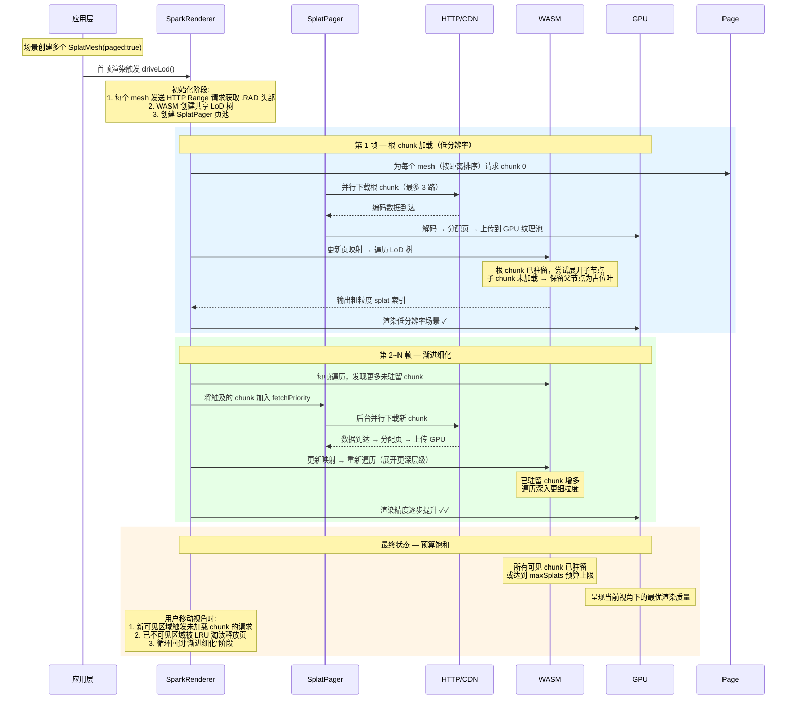

# Spark 渐进式渲染生命周期（精简版）



---

# 由粗到精渲染 & 触发精细 chunk 下载的代码定位

这两个机制体现在两处代码：

## 1. 由粗到精渲染 — `traverse_lod_trees()` in `rust/spark-rs/src/lod_tree.rs:481-540`

关键逻辑：遍历时用最大堆按屏幕像素尺度排序 splat，尝试展开子节点。**若子节点所在 chunk 未驻留（`chunk_to_page[chunk] == 0xFFFFFFFF`），则保留父节点为占位叶节点**：

```rust
// lod_tree.rs:522-525
if first_page == 0xFFFFFFFF || last_page == 0xFFFFFFFF {
    output.push((inst_index, paged_index));  // ← 保留父节点作粗粒度表示
    continue;
}
```

父 splat 尺寸更大、精度更粗，但保证场景始终可视。等子 chunk 下载完毕后，下次遍历 `chunk_to_page` 不再是 `0xFFFFFFFF`，便会展开到更精细的子节点 —— 这就是"由粗到精"。

## 2. 触发更精细 chunk 下载 — `SparkRenderer.ts:1500-1507`

遍历返回的 `chunks` 数组（即 WASM 中 `touched` 列表，记录遍历过程"触碰到但未驻留"的 chunk）会被追加到 `fetchPriority`：

```typescript
// SparkRenderer.ts:1500-1507
for (const [lodId, chunk] of chunks) {  // ← traverse 返回的 touched chunks
  const splats = this.lodIdToSplats.get(lodId);
  if (splats instanceof PagedSplats) {
    if (chunk !== 0) {
      this.pager.fetchPriority.push({ splats, chunk });  // ← 触发下载
    }
  }
}
```

而 WASM 中记录 touched 的代码在 `lod_tree.rs:505-513`：

```rust
// lod_tree.rs:505-513
let first_chunk = child_start >> 16;
if touched_set.insert((*lod_id, first_chunk)) {
    touched.push((*lod_id, first_chunk));  // ← 记录需要下载的 chunk
}

let last_chunk = (child_start + child_count as u32 - 1) >> 16;
if last_chunk != first_chunk && touched_set.insert((*lod_id, last_chunk)) {
    touched.push((*lod_id, last_chunk));
}
```

## 闭环流程

| 步骤 | 位置 | 作用 |
|------|------|------|
| ① 遍历尝试展开子节点 | `lod_tree.rs:527` | 检查 `chunk_to_page` |
| ② chunk 未驻留 → 保留父节点 | `lod_tree.rs:522-525` | 粗粒度渲染 |
| ③ 记录 touched chunk | `lod_tree.rs:505-513` | 标记需下载 |
| ④ 返回 touched 给 JS | `lod_tree.rs:583-588` | `out_chunks` |
| ⑤ 追加到 fetchPriority | `SparkRenderer.ts:1500-1504` | 触发下载 |
| ⑥ 下帧 chunk 驻留 → 展开子节点 | 回到 ① | 精细化 |

每帧循环 ①→⑤，chunk 不断流入，traverse 展开深度递增，渲染由粗到精。
