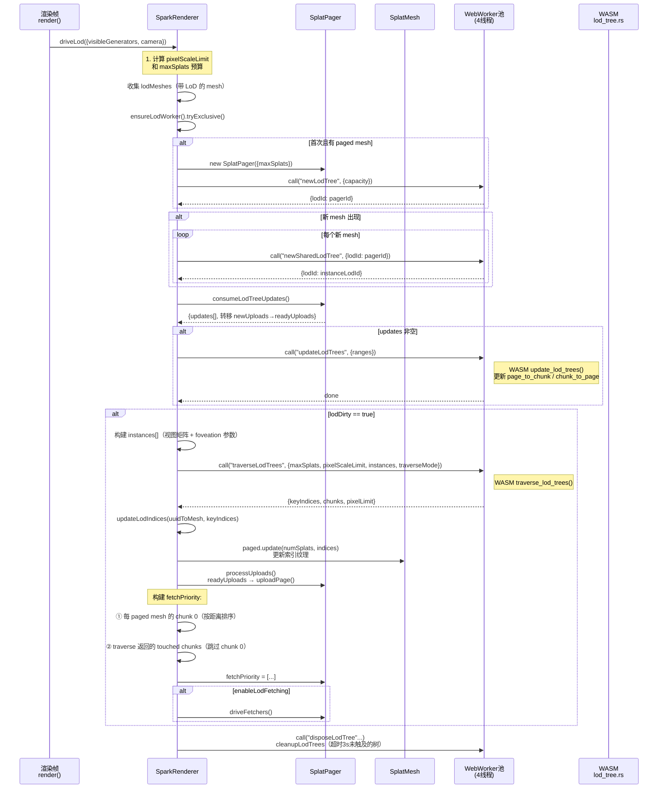
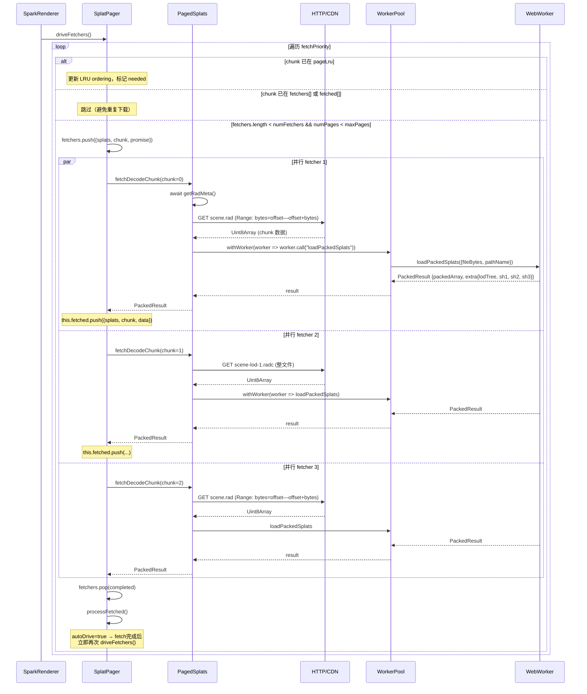
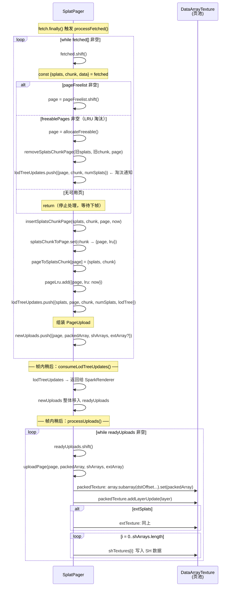
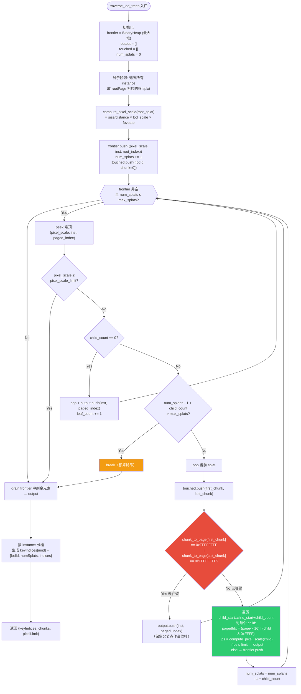
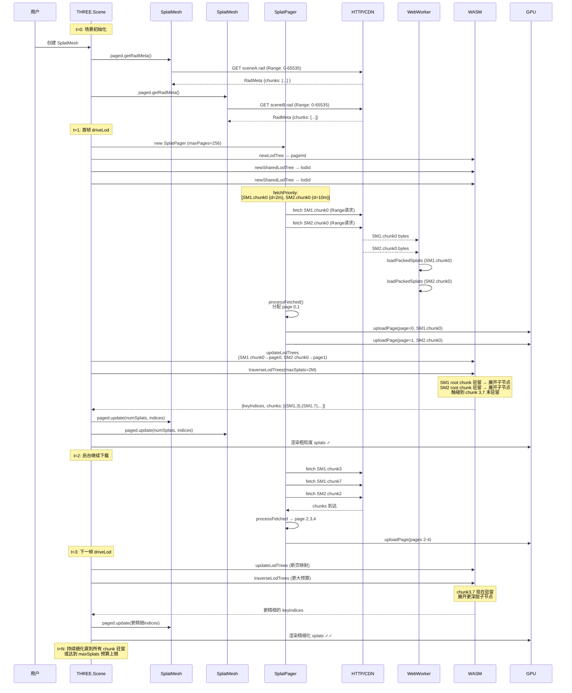
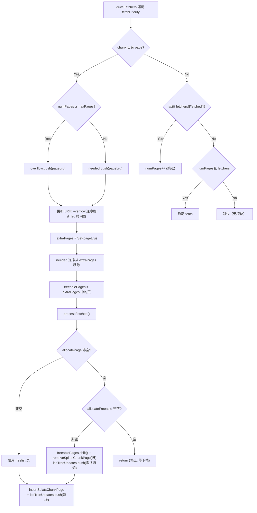
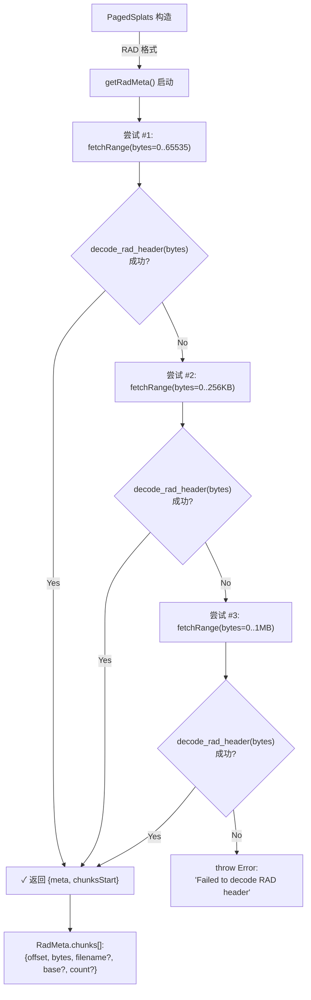
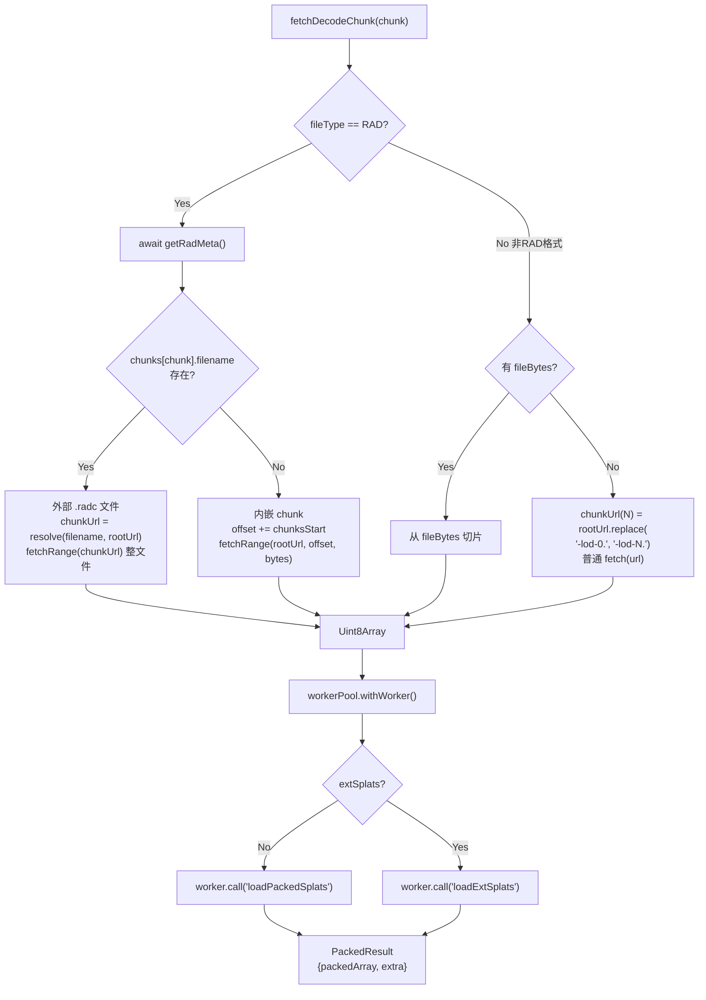

# Spark 流式下载 + 渐进式加载 流程图与时序图

## 1. 端到端系统流程图

```mermaid
flowchart TD
    subgraph OFFLINE["🔨 离线构建"]
        A[输入 .ply/.spz] --> B[compute_lod_tree<br/>tiny_lod.rs / bhatt_lod.rs]
        B --> C[chunk_tree<br/>切分 ~64K splats/chunk]
        C --> D[RadEncoder<br/>写入 .RAD 头 + .RADC 分块]
        D --> E["scene-lod.rad (头)<br/>scene-lod-0.radc<br/>scene-lod-1.radc ..."]
    end

    subgraph RUNTIME["🖥 运行时流式加载"]
        F["SplatMesh({paged:true})"] --> G["PagedSplats 创建"]
        G --> H["getRadMeta()<br/>HTTP Range 65KB→256KB→1MB 三档"]
        H --> I["RadMeta<br/>{chunks[], count, maxSh}"]
        I --> J["SparkRenderer.driveLod()"]
        J --> K["创建 SplatPager<br/>GPU 页池 256×64K"]
        K --> L["WASM new_lod_tree /<br/>new_shared_lod_tree"]
        L --> M["consumeLodTreeUpdates()<br/>+ updateLodTrees()"]
        M --> N["traverse_lod_trees()<br/>最大堆贪心遍历"]
        N --> O["updateLodIndices()<br/>更新索引纹理"]
        O --> P["构建 fetchPriority<br/>根chunk优先 + 触及chunk"]
        P --> Q["SplatPager.driveFetchers()"]
        Q --> R["PagedSplats.fetchDecodeChunk()<br/>HTTP Range / 整文件"]
        R --> S["WebWorker 解码"]
        S --> T["processFetched()<br/>allocatePage + insertChunk"]
        T --> U["uploadPage()<br/>写入 DataArrayTexture"]
        U --> V["GPU 渲染<br/>pagedSplatTexCoord → texelFetch"]
    end

    OFFLINE -->|"产出 .rad + .radc"| RUNTIME
```

## 2. 每帧驱动 LoD 主循环时序图

## 3. Chunk 并行下载 + 页面分配时序图

## 4. processFetched → GPU 上传 详细时序图

## 5. WASM traverse_lod_trees 算法流程图

## 6. 渐进式渲染完整生命周期时序图

## 7. 页面淘汰（LRU Eviction）流程图

## 8. fetchSplat GPU Shader 读取路径

```mermaid
flowchart LR
    subgraph VERTEX["Vertex Shader / Splat Generator"]
        IDX[index: logical splat index] --> READ_IDX["readIndex()<br/>indices 纹理查找"]
        READ_IDX --> SPLAT_IDX["splatIndex = texelFetch(indices, ...)[comp]"]
    end

    SPLAT_IDX --> HAS_EXT{extSplats?}

    HAS_EXT -->|No packed| PAGED_COORD["pagedSplatTexCoord(index)<br/>= ivec3(idx & 255,<br/>(idx>>8)&255, idx>>16)"]
    PAGED_COORD --> PACKED_FETCH["texelFetch(packedTexture, coord, 0)"]
    PACKED_FETCH --> UNPACK["unpackSplatEncoding()<br/>→ center, scales, quat, rgba"]

    HAS_EXT -->|Yes| EXT_FETCH["texelFetch(packedTexture + extTexture)"]
    EXT_FETCH --> EXT_UNPACK["unpackSplatExt()<br/>→ center, scales, quat, rgba"]

    UNPACK --> HAS_SH{hasRgbDir?<br/>viewOrigin?}
    EXT_UNPACK --> HAS_SH

    HAS_SH -->|No| OUT[gsplat]
    HAS_SH -->|Yes| SH_EVAL["evaluatePackedSH / evaluateExtSH<br/>viewDir × shTextures[0..3]"]
    SH_EVAL --> ADD["rgb += shRgb"]
    ADD --> OUT
```

## 9. 三档 RAD Header 渐进请求流程

## 10. chunk 下载地址生成策略

